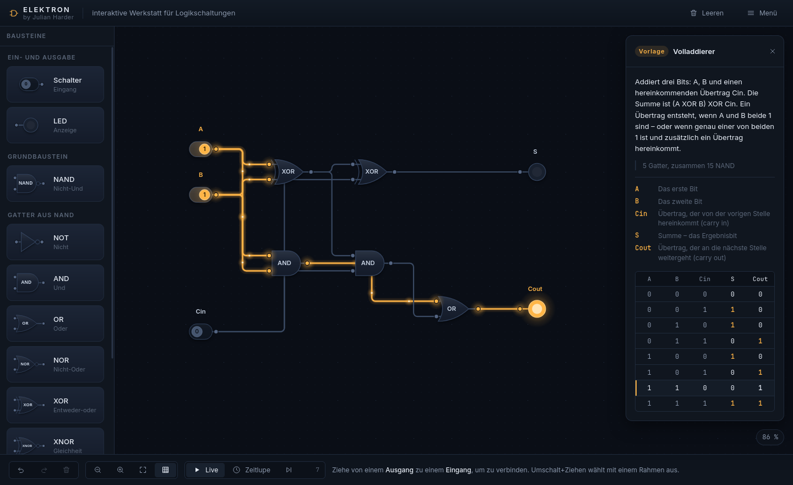
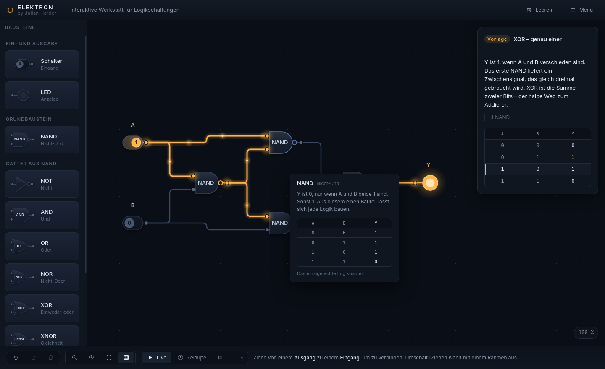
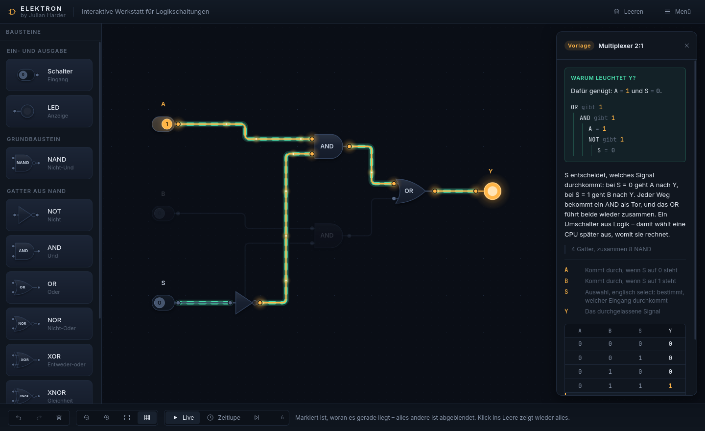
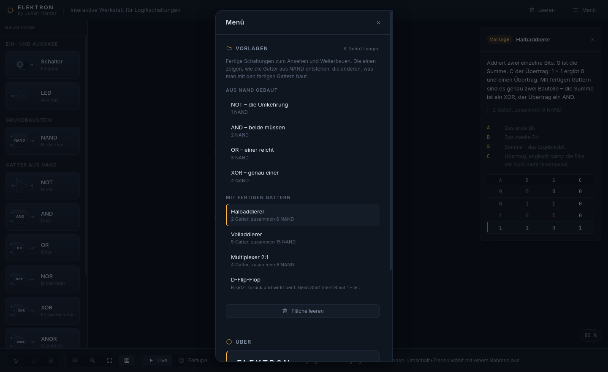

# ELEKTRON

**Interaktive Werkstatt für Logikschaltungen** — von Julian Harder

Aus einem einzigen NAND-Gatter Schritt für Schritt alles selbst bauen. Keine
Level, keine Aufgaben, keine Bewertung: Man baut frei, und die Wahrheitstabelle
rechnet laufend mit, was dabei herauskommt.

*Elektron ist das griechische Wort für Bernstein. Aus ihm wurde später das Wort
Elektrizität — und von dort kommt das warme Amber, in dem hier die Signale
leuchten.*



---

## Starten

**Doppelklick auf `index.html`.** Das ist alles.

Ist für den Desktop optimiert. Am Handy ist es nicht so optimal zu sehen

Link zur Livedemo: https://julianharder.github.io/Elektron---Interaktive-Werkstatt-f-r-Logikschaltungen/

Keine Installation, kein `npm install`, kein Build-Schritt, kein Server. Die
Seite läuft direkt von der Festplatte (`file://`) in Chrome und Firefox. Auch
die Schriften liegen lokal bei — die Seite lädt nichts aus dem Netz.

---

## Die Idee

Es gibt genau **ein** echtes Logikbauteil: das NAND. Alles andere entsteht
daraus.

NOT, AND, OR, NOR, XOR und XNOR stehen zwar fertig in der Bausteinleiste, sind
aber keine eigene Rechenart — beim Rechnen löst `compile.js` jedes davon wieder
in NAND-Gatter auf. Die NAND-Zahl, die überall angezeigt wird, ist deshalb
ehrlich: Ein Volladdierer aus fertigen Gattern kostet wirklich 15 NAND.



Der Tooltip schreibt seine Wahrheitstabelle nicht ab, sondern **rechnet sie
aus**: Für den Gattertyp entsteht eine Mini-Schaltung, die wirklich durch die
Simulation läuft. Eine gepflegte Liste wäre eine zweite Wahrheit, die irgendwann
von der ersten abweicht.

---

## „Warum leuchtet das?"

Die Wahrheitstabelle sagt, **was** eine Schaltung tut. Ein Klick auf eine Lampe
sagt, **warum** sie es gerade tut.



Gesucht wird rückwärts von der Lampe bis zu den Schaltern. Der Kniff: Oft genügt
**ein** Eingang. Ein OR, das 1 ausgibt, braucht dafür nur einen Eingang auf 1 —
der andere ist unbeteiligt, egal wie er steht. Dadurch schrumpft die Begründung
auf das, worauf es wirklich ankommt. Beim Multiplexer oben steht deshalb nur
`A = 1` und `S = 0` da, obwohl drei Schalter angeschlossen sind.

Der Weg dorthin wird auf der Fläche markiert, alles andere blendet ab. Benannt
wird mit denselben Namen, unter denen die Bauteile auch in der Tabelle und auf
der Fläche stehen.

Formuliert ist es als **„dafür genügt"** und nicht als „nur deshalb" — es ist
ein ausreichender Grund, nicht der einzige. Dass dieser Anspruch hält, wird
nachgerechnet: alle Vorlagen, alle Schalterstellungen, alle Lampen, die übrigen
Schalter jeweils in allen Kombinationen durchgespielt.

---

## Vorlagen

Acht fertige Schaltungen zum Ansehen und Weiterbauen. Die einen zeigen, wie die
Gatter aus NAND entstehen, die anderen, was man mit den fertigen Gattern baut.



| Aus NAND gebaut | | Mit fertigen Gattern | |
|---|---|---|---|
| NOT – die Umkehrung | 1 NAND | Halbaddierer | 6 NAND |
| AND – beide müssen | 2 NAND | Volladdierer | 15 NAND |
| OR – einer reicht | 3 NAND | Multiplexer 2:1 | 8 NAND |
| XOR – genau einer | 4 NAND | D-Flip-Flop | 29 NAND |

Eine Vorlage ersetzt die Fläche oder stellt sich daneben. Eingesetzt wird über
denselben umkehrbaren Befehl wie Kopieren und Einfügen — **Strg+Z nimmt auch das
zurück.**

Die Fachnamen werden erklärt: Jede Vorlage bringt mit, was ihre Anschlüsse
bedeuten (`CLK` – Takt, englisch clock …). Die Erklärung steht in der Vorlage
und nicht in einer allgemeinen Liste, denn „S" heißt beim Halbaddierer Summe und
beim Multiplexer Auswahl.

---

## Was sonst noch drin ist

**Simulation wie in echt.** Flache NAND-Netzliste in typisierten Arrays, eine
Gatterlaufzeit pro Tick. Deshalb verhalten sich Rückkopplungen richtig: Ein
SR-Latch hält seinen Wert, ein Ring aus drei Invertern schwingt — und das wird
erkannt und gesagt, statt die Seite anzuhalten.

**Drei Gangarten.** *Live* rechnet sofort zu Ende, *Zeitlupe* zeigt das Signal
von Gatter zu Gatter wandern, *Einzelschritt* rechnet genau einen Tick pro Klick.

**Die Wahrheitstabelle rechnet aus der Schaltung selbst**, nicht gegen eine
Vorgabe: jeder Schalter eine Spalte links, jede Lampe eine Spalte rechts. Drei
Grenzen sind eingebaut und werden jeweils begründet — Rückkopplung, laufender
Takt, mehr als sechs Schalter.

**Undo überall.** Auch das Leeren der Fläche und das Einsetzen einer Vorlage sind
ganz normale Befehle. Deshalb braucht „Leeren" keine Rückfrage.

**Einen Draht verfolgen.** Liegen viele Leitungen übereinander, hebt sich die
angefasste mit einer dunklen Fassung aus dem Gewirr heraus.

**Eigener Look.** Alle Symbole sind eigene Vektorzeichnungen, alle Icons eigene
Inline-SVGs. Keine Emojis, keine Standard-Formularelemente, keine Bibliothek.
`styleguide.html` zeigt jedes Bauteil in jedem Zustand.

---

## Was es bewusst *nicht* gibt

Das ist keine Liste fehlender Funktionen, sondern eine Liste von Entscheidungen.

- **Keine Level, keine Aufgaben, keinen Prüfen-Knopf.** Die Tabelle zeigt, was
  die Schaltung tut — nicht, ob sie etwas Vorgegebenes erfüllt.
- **Keine Spielstände, kein Export.** Gesichert wird still genau die eine
  laufende Schaltung, damit ein Neuladen nichts kostet. Mehr nicht.
- **Keine eigenen Bausteine.** Diese Etappe war fertig gebaut und wurde wieder
  entfernt: Ein Baustein muss irgendwo liegen, sonst ist er nach dem Neuladen
  weg und nimmt die Schaltung mit, die ihn benutzt. Beides zusammen ging nicht,
  und die Entscheidung fiel gegen die Bausteine.

---

## Aufbau

Vanilla JavaScript (ES2018, ohne Module), Canvas 2D für die Arbeitsfläche,
HTML und CSS für die Oberfläche. 8788 Zeilen in 67 Dateien, keine über 500
Zeilen, längste 316.

```
index.html          Skripte in fester Reihenfolge, keine Ladefunktionen
styleguide.html     jedes Bauteil in jedem Zustand
js/model/           Daten: Schaltung, Befehle, Undo, Speichern
js/sim/             Rechnen: Netzliste, Engine, Takt, Tabellen, Begründung
js/render/          Zeichnen: Kamera, Symbole, Leitungen, Sprites
js/interact/        Werkzeuge: Platzieren, Verbinden, Auswählen, Tastenkürzel
js/ui/              Oberfläche: Leiste, Karte, Menü, Tooltip
js/templates/       die acht Vorlagen
js/app/             setzt alles zusammen
js/util/            kleine Helfer (DOM, Mathe, ids, Speicher)
css/                Tokens zuerst, danach die Bereiche
assets/fonts/       Inter und JetBrains Mono, lokal
```

Drei Schichten, die sich nur über klare Schnittstellen kennen: **Modell**
(Daten), **Simulation** (rechnet), **Darstellung** (zeichnet). Jede Änderung am
Modell läuft über einen umkehrbaren Befehl — nur deshalb ist Undo lückenlos.

Dass es ohne Build läuft, ist kein Zufall, sondern eine harte Regel: keine
ES-Module, kein `fetch`, keine Web Worker, keine CDN-Links, kein npm zur
Laufzeit. Jede Datei ist eine IIFE im Namensraum `window.CIRCUIT`.

---

## Geprüft

Vor der Veröffentlichung wurde die Logik vollständig gegen die echte Simulation
nachgerechnet — **103 Prüfungen, kein Fehler**. Jede Erwartung ist unabhängig
ausgerechnet, sonst prüfte sich der Code gegen sich selbst.

| | |
|---|---|
| Gatterlogik | alle 7 Typen, jede Zeile, durch Übersetzer und Engine |
| NAND-Zahl | je Gatter gegen die angezeigte Angabe |
| Quellen und Senken | Schalter, Konstante, Takt, Lampe, offener Eingang, Fan-out |
| Rückkopplung | SR-Latch hält; Ringe aus 3 und 5 Invertern schwingen, aus 2 und 4 nicht |
| Vorlagen | alle acht, volle Wahrheitstabelle; D-Flip-Flop über zehn Takte |
| Wahrheitstabelle | Zeilen, Rückkopplung, laufender Takt, Grenzen, Auswahlfilter |
| Befehle | Undo bis leer und Redo zurück — Ergebnis identisch |
| Speichern | alle Vorlagen: speichern, laden, rechnen — unverändert |
| Begründungen | 69 Nachrechnungen über alle Vorlagen und Stellungen |

Dazu im Browser: acht Vorlagen eingesetzt, 18 Schalter umgelegt, 72 Leitungen
angefasst, 11 Lampen erklärt, alle drei Gangarten, Undo bis leer und zurück,
gespeichert und neu geladen — **Chrome und Firefox jeweils ohne eine einzige
Konsolenmeldung.**

---

## Schriften

[Inter](https://rsms.me/inter/) 4.1 und
[JetBrains Mono](https://www.jetbrains.com/lp/mono/) 2.304, beide unter der
SIL Open Font License. Die Lizenztexte liegen in `assets/fonts/` und gehören
mit ausgeliefert.

---

Mit freundlicher Unterstützung der KI erstellt
